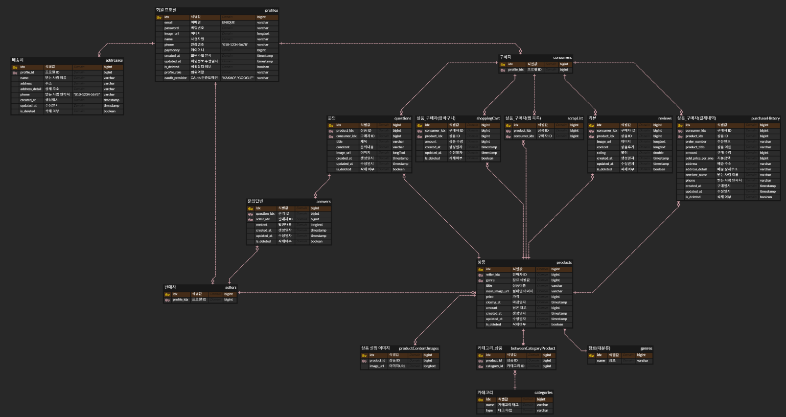
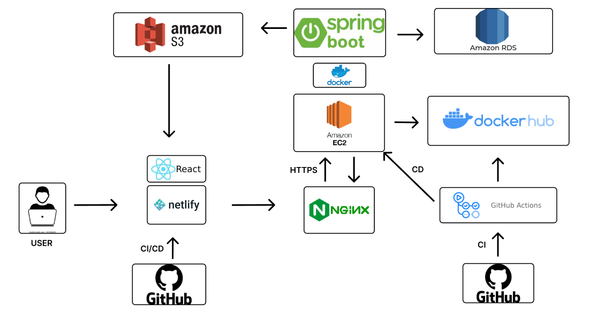

# [SuperBoard 보드게임 쇼핑몰](https://super-boarding.netlify.app/)

### 프로젝트 기간

- 2023-08-14 ~ 2023-08-25 (12일)

## 프로젝트 참여자

### 백엔드
| &nbsp;&nbsp;&nbsp;&nbsp;&nbsp;&nbsp;&nbsp;&nbsp;&nbsp;&nbsp;&nbsp;&nbsp;&nbsp;&nbsp;&nbsp;&nbsp;&nbsp;&nbsp; 노원호 &nbsp;&nbsp;&nbsp;&nbsp;&nbsp;&nbsp;&nbsp;&nbsp;&nbsp;&nbsp;&nbsp;&nbsp;&nbsp;&nbsp;&nbsp;&nbsp;&nbsp;&nbsp; | &nbsp;&nbsp;&nbsp;&nbsp;&nbsp;&nbsp;&nbsp;&nbsp;&nbsp;&nbsp;&nbsp;&nbsp;&nbsp;&nbsp;&nbsp;&nbsp;&nbsp;&nbsp; 황민혁 &nbsp;&nbsp;&nbsp;&nbsp;&nbsp;&nbsp;&nbsp;&nbsp;&nbsp;&nbsp;&nbsp;&nbsp;&nbsp;&nbsp;&nbsp;&nbsp;&nbsp;&nbsp; | &nbsp;&nbsp;&nbsp;&nbsp;&nbsp;&nbsp;&nbsp;&nbsp;&nbsp;&nbsp;&nbsp;&nbsp;&nbsp;&nbsp;&nbsp;&nbsp;&nbsp;&nbsp; 이우진 &nbsp;&nbsp;&nbsp;&nbsp;&nbsp;&nbsp;&nbsp;&nbsp;&nbsp;&nbsp;&nbsp;&nbsp;&nbsp;&nbsp;&nbsp;&nbsp;&nbsp;&nbsp; | &nbsp;&nbsp;&nbsp;&nbsp;&nbsp;&nbsp;&nbsp;&nbsp;&nbsp;&nbsp;&nbsp;&nbsp;&nbsp;&nbsp;&nbsp;&nbsp;&nbsp;&nbsp; 이재준 &nbsp;&nbsp;&nbsp;&nbsp;&nbsp;&nbsp;&nbsp;&nbsp;&nbsp;&nbsp;&nbsp;&nbsp;&nbsp;&nbsp;&nbsp; |  
|:-----------------------------------------------------------------------------------------------------------------------------------------------------------------------------------------------------------------------------:|:-----------------------------------------------------------------------------------------------------------------------------------------------------------------------------------------------------------------------------:|:-----------------------------------------------------------------------------------------------------------------------------------------------------------------------------------------------------------------------------:|:-----------------------------------------------------------------------------------------------------------------------------------------------------------------------------------------------------------:|  
|                                                                         - 팀장   - Back-end   - 상품    - [GitHub](https://github.com/no-oneho)                                                                          |                                                                 - 팀원   - Back-end  - 결제   - 리뷰    - [GitHub](https://github.com/koeyismyusername)                                                                 |                                                                    - 팀원  - Back-end   - Infra  - 회원   - [GitHub](https://github.com/zmfpdl64)                                                                     |                                                                  - 팀원  - Back-end   -문의  - [GitHub](https://github.com/doit-zero)                                                                  | 

## 💁‍♂️ Detail Role 
+ [노원호](https://github.com/no-oneho)
    - 팀장
    - Github Actions CI/CD 구축
    - Swagger 문서화
 

+ [황민혁](https://github.com/koeyismyusername)
    - 팀원
    - Swagger 문서화
 

+ [이우진](https://github.com/zmfpdl64)
  - 팀원
  - 전체적인 AWS 환경 구축
  - 로그인, Kakao OAuth, 인증기능, Jwt, 회원정보 수정
  - Swagger 문서화
 
  
+ [이재준](https://github.com/doit-zero)
    - 팀원
    - Swagger 문서화
 

# 👨‍🔧기술 스택
- Java 11
- Gradle
- Spring Boot 2.7
- Spring Security
- JPA
- MySQL
- AWS S3
- AWS EC2
- AWS RDS

# 📜ERD(Entity Relation Diagram)

# 📈서비스 아키텍처

